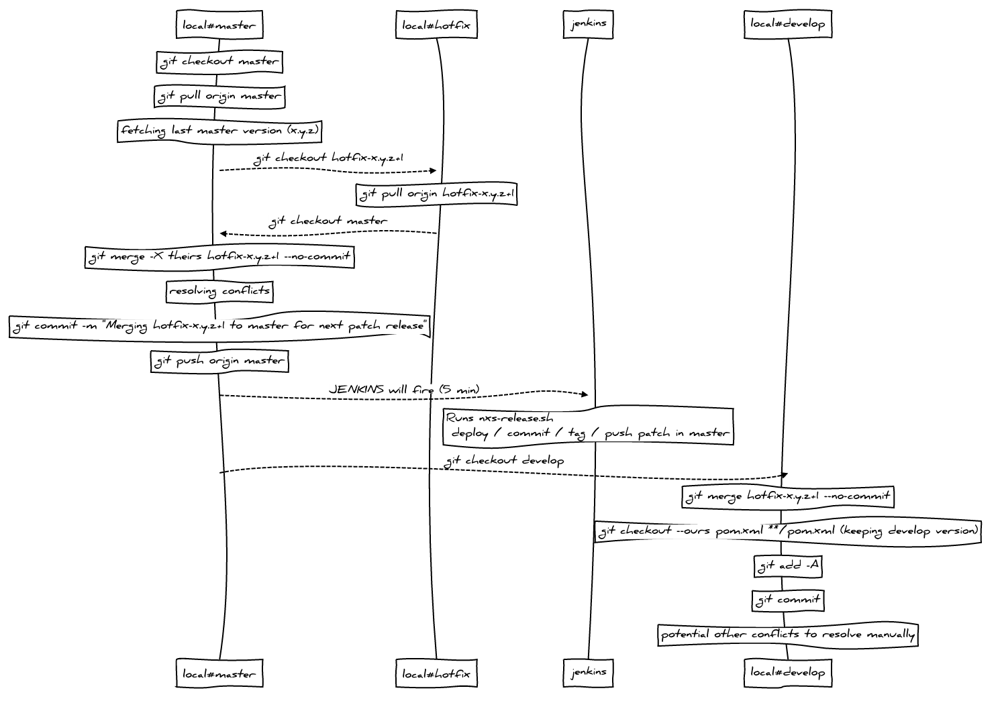

# nextprot-scripts


Contains scripts for installation and deployment of nextprot apps and databases.

## Preparing new releases

The script `nxs-fire-and-prepare-next-release.sh` executes the following instructions:

1. it merges branch develop into master (triggering the execution of `nxs-release.sh` by jenkins to create a new release)
2. it prepare the next development snapshot in develop

Here is the usage:

```
$ nxs-fire-and-prepare-next-release.sh -h
usage: nxs-fire-and-prepare-next-release.sh <next-snapshot-version> [repo]
This script fires indirectly a new production release (through jenkins) and prepares next development release with the given version (-SNAPSHOT is added automatically)
Params:
 <next-snapshot-version> next snapshot version (MAJOR.MINOR.PATCH)
 <repo> optional maven project git repository
Options:
 -h print usage
```

#### Sequence diagram


## Preparing new patches

This delicate operation is handled partly by scripts:

1. the first one creates and prepares a new hotfix branch from master
2. the last one merges back to master and to develop once the developer made the fix on hotfix branch

### Step 1: Creating and initializing a new `hotfix` branch

The script `nxs-checkout-hotfix-branch.sh` executes the following instructions:

1. it creates a branch named `hotfix-x.y.z+1` from branch master version x.y.z
2. it updates the patch version in all pom.xml files
3. it commits and pushes those changes in the hotfix branch

Here is the usage:

```
$ nxs-checkout-hotfix-branch.sh -h
usage: nxs-checkout-hotfix-branch.sh [repo]
This script prepares and inits the next hotfix branch coming from master and checkout to it (after it, you can start fixing it :))
Params:
 <repo> optional maven project git repository
Options:
 -h print usage
```

#### Sequence diagram


### Step 2: Fixing the bug...

This step should be handled by the programmer responsible of fixing the bug.

### Step 3: Finalizing and publishing the hot fix

Once the fix is done, `nxs-fire-patch-release.sh` automatically merges the proper hotfix branch back to master and to develop branches:

1. it fetches the last hotfix version `x.y.z+1` from master (version x.y.z)
2. it merges and push hotfix branch back to master
3. it merges hotfix branch to develop without pushing to origin/develop

```
$ nxs-fire-patch-release.sh -h
usage: nxs-fire-patch-release.sh [-h][repo]
This script makes a new patch release.
It merges the hotfix branch back to master, merges to develop with pom.xml versions kept as in develop.
Once it is pushed to origin/master jenkins will publish the new patch with script 'nxs-release.sh'
Params:
 <repo> optional maven project git repository
Options:
 -h print usage
```

Note that there are multiple check points where user is asked to validate some git actions.

If everything goes ok, the terminal points to the develop branch with a git status output
notifying that "Your branch is ahead of 'origin/develop' by n commits."

Then the programmer has to check that everything is ok before pushing to origin/develop manually.

#### Sequence diagram


